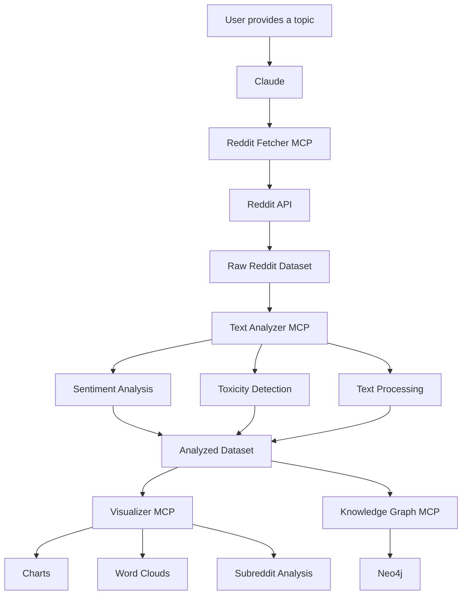
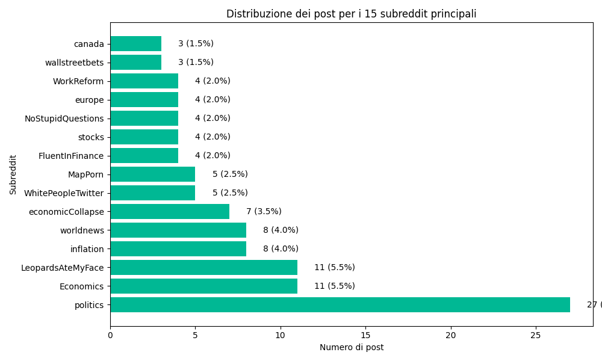
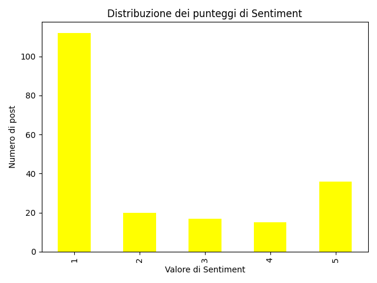
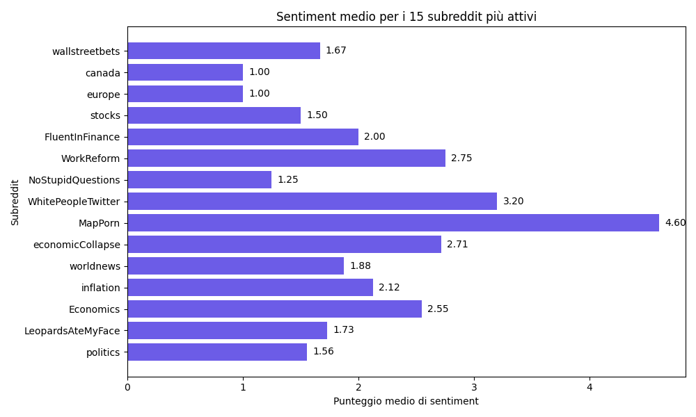
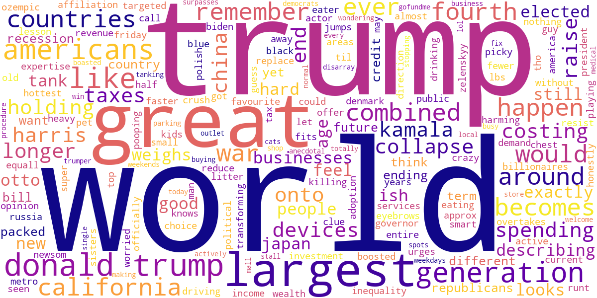
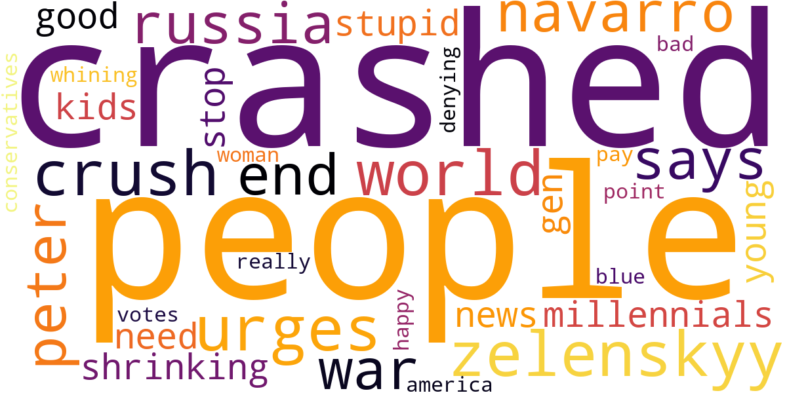
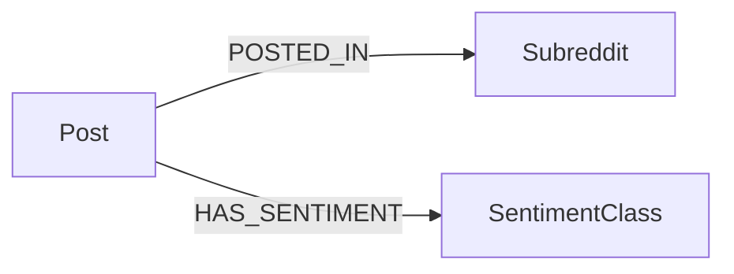

<div align="center">

# Reddit MCP NLP Analysis Pipeline

### An MCP pipeline for Reddit data collection, NLP analysis, visualization, and Knowledge Graph generation, orchestrated by Claude.

**Reddit API · MCP · Transformers · NLP · Neo4j · Python**

</div>

---

## Overview

This project connects Claude to a set of MCP servers that, starting from a simple topic (e.g. `economy`), handle:

- fetching relevant Reddit posts;
- cleaning and preparing the text;
- sentiment analysis and toxicity detection;
- descriptive statistics and cross-subreddit comparisons;
- charts and word clouds;
- optionally, building a Knowledge Graph in Neo4j.

Each stage is handled by an independent MCP server: Claude calls them in sequence, but each one can also be used on its own.

---

## How it works



---

## The MCP servers

The project is split into four specialized MCP servers.

**Reddit Fetcher** – retrieves posts for a given topic: searches Reddit, extracts text and metadata, saves results as CSV, merges different datasets, and keeps track of what's already saved locally.

**Text Analyzer** – does the actual NLP work: sentiment analysis, toxicity detection, language detection, word-frequency stats, descriptive statistics, extraction of positive/negative/toxic examples. The output dataset is enriched with fields like:

```text
sentiment_score
toxic_lab
toxic_score
is_toxic
```

**Visualizer** – turns the analyzed data into visual output: sentiment distribution, posts per subreddit, average sentiment per subreddit, word clouds (including one for the toxic subset only).

**Knowledge Graph** – final, optional step: loads the analyzed dataset into Neo4j, modeling relationships between posts, subreddits, and sentiment class:

```text
Post
 │
 ├── POSTED_IN ────────> Subreddit
 │
 └── HAS_SENTIMENT ────> SentimentClass
```

---

## Example — topic "economy"

To test the pipeline we analyzed Reddit posts related to `economy`. Some of the generated outputs below.

### Activity by subreddit

Which subreddits contributed the most posts to the dataset.

<p align="center">
  
</p>

### Sentiment distribution

Each post gets a sentiment score; here's the distribution across the whole dataset.

<p align="center">
  
</p>

### Sentiment by subreddit

Comparing average sentiment across the most active communities.

<p align="center">
  
</p>

### What's being discussed

Word cloud generated from the analyzed discussion, for a quick sense of recurring terms.

<p align="center">
  
</p>

### Toxic content

Posts classified as potentially toxic are isolated and analyzed separately. Here's the word cloud of the most common terms in that subset.

<p align="center">
  
</p>

---

## Example usage

Just ask something like:

```text
Analyze the Reddit discussion around the economy.
```

and Claude orchestrates the MCP tools through fetching → NLP analysis → visualizations and/or Knowledge Graph, with no need to set up the pipeline manually each time.

---

## NLP models

Sentiment analysis: `nlptown/bert-base-multilingual-uncased-sentiment`

Toxicity detection: `facebook/roberta-hate-speech-dynabench-r4-target`

Both via Hugging Face `transformers`.

---

## Knowledge Graph

Current graph structure in Neo4j:



Each `Post` node can hold properties like `id`, `title`, `sentiment_score`, `toxic_score`, `is_toxic`.

---

## Tech stack

| Technology | Purpose |
|---|---|
| **Python** | Core language |
| **FastMCP** | MCP server/tool implementation |
| **PRAW** | Reddit API access |
| **Hugging Face Transformers** | NLP models |
| **Pandas** | Data manipulation |
| **NLTK** | Text preprocessing |
| **LangDetect** | Language detection |
| **Matplotlib** | Charts |
| **WordCloud** | Word cloud generation |
| **Neo4j** | Knowledge Graph storage and querying |

---

## Configuration

Before using the Reddit Fetcher, you'll need Reddit API credentials:

```text
client_id
client_secret
user_agent
username
password
```

Don't publish real credentials in the repo.

Local directories used by the MCP servers need to be adapted to your own environment.

For the Knowledge Graph, you'll need a running Neo4j instance with:

```text
NEO4J_URI
NEO4J_USER
NEO4J_PASSWORD
```

---

## Reusability

The pipeline isn't tied to the `economy` example — the same architecture works with any topic ("artificial intelligence", "bitcoin", "climate change", etc.) with no changes needed.

---

<div align="center">

## Reddit → NLP → Insights

</div>
